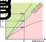
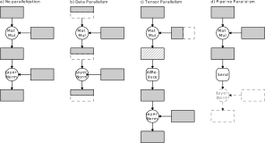
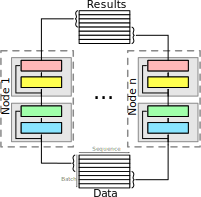
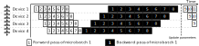
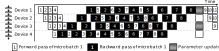
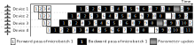
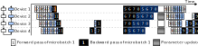
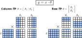
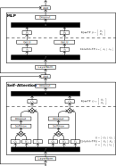

# Parallelisierung des Maschinellen Lernens

Jüngste Forschungen über skalierbare Architekturen wie den Transformer [@vaswaniAttentionAllYou2017] haben gezeigt, dass die Leistungsfähigkeit von neuronalen Netzen mit der Anzahl ihrer Parameter korreliert [@kaplanScalingLawsNeural2020] und dabei mit besonders großen Netzwerken beeindruckende Ergebnisse erzielt [@openaiIntroducingChatGPT2022; @openaiGPT4TechnicalReport2023]. Dies führte jüngst zu einem Wettlauf um die größten Modelle und damit verbunden einem drastischen Anstieg der Anforderungen an die Trainings- und Inferenz-Hardware. Diese Architekturen lassen sich zwar quasi beliebig vergrößern, doch sind der Skalierung in der Praxis durch die Hardware Grenzen gesetzt [@narayananEfficientLargescaleLanguage2021]. So hat sich beispielsweise die Zahl der Parameter der größten Modelle von 2018 bis 2021 vertausendfacht, während die Speicherkapazität der populärsten Beschleuniger, Nvidia-Grafikkarten, sich in demselben Zeitraum lediglich verdoppelt hat. Mit der Größe der neuronalen Netze steigt auch die Trainingszeit und die Anzahl der für das Training benötigten Daten stetig an. Um also das Training immer größerer Modelle zu ermöglichen, ist die Verteilung der Rechenleistung auf mehrere Rechenknoten unumgänglich.

: Größenentwicklung von neuronalen Netzen über die Zeit. Im Zeitraum von 2018 bis 2021 ist die Anzahl der Parameter in modernen neuronalen Netzen exponentiell angestiegen. Quelle: [@narayananEfficientLargescaleLanguage2021].

Dieser Artikel soll eine Einführung in das verteilte Rechnen mit dem Fokus auf das maschinellen Lernen bieten. Zunächst werden die Grundlagen erläutert, anschließend werden mit Daten- und Modellparallelisierung sowie Mixture of Experts verschiedene Formen der Parallelisierung eingeführt, die in der jüngsten Literatur diskutiert werden und in der Praxis bereits rege Anwendung finden.

## Grundlagen

Das Training immer größerer neuronaler Netze stellt die Entwickler vor zwei grundsätzliche Probleme: 

1. die für das Training nötige Rechenzeit steigt mit der Anzahl der zu trainierenden Parameter an,
2. der Speicher aktueller Grafikkarten ist zu klein für die großen Modelle inklusive ihrer Aktivierungen und Gradienten.

Diese Probleme können jeweils durch die Verteilung des Trainings auf mehrere Rechenknoten gelöst werden. Das Training von Modellen der Größe von ChatGPT und GPT-4 wird durch Parallelisierung überhaupt erst möglich gemacht. Doch führt diese Parallelisierung zu einem weiteren Problem:

3. der durch Kommunikation und Synchronisation der Rechenknoten entstehende Mehraufwand steigt mit der Anzahl der Rechenknoten an.

### Scale Out Vs. Scale Up 🚧

- Scale Up nur begrenzt möglich, scale out erlaubt in der Theorie beliebige Skalierungsfaktoren (siehe [unten](#skalierbarkeit)).
- Effizienzsteigerung eine Form von Scle UP?

### Skalierbarkeit

- Ahmdahl: strong scaling🚧
- Gustavson: weak scaling🚧

Soll durch eine Parallelisierung die Rechenzeit verkürzt werden, ist eine Betrachtung des Skalierungsverhaltens des Programms vonnöten. Nicht jedes Programm profitiert gleichermaßen von einer Verteilung auf mehrere Prozesse. Die Beschleunigung $S_p$ (engl.: *Speedup*), die durch die Verteilung auf $p$ Prozesse erreicht wird, ist das Verhältnis zwischen der Rechenzeit[^Latenz] eines einzelnen Prozesses $T_1$ zur Rechenzeit von $p$ Prozessen $T_p$:

$$
S_p = \frac{T_1}{T_p}
$$
Auf Basis der Beschleunigung kann die Effizienz $E_p$ als das Verhältnis der Beschleunigung $S_p$ zur Anzahl der Prozesse $p$ berechnet werden: 

$$
E_p = \frac{S_p}{p} = \frac{T_1}{T_p \cdot p}
$$
Die Effizienz (engl.: *efficiency*) gibt an, inwiefern das betrachtete Programm durch die Verteilung auf $n$ Prozesse profitiert. Bei einer Effizienz von $E_p = 1$ skaliert das Programm *linear*, also eine Erhöhung der Rechenkerne um einen Faktor $f$ führt zu einer Erhöhung der Beschleunigung um den gleichen Faktor. Eine Effizienz von $E_p < 1$ deutet auf ein sub-lineares Skalierungsverhalten hin und eine Effizienz von $E_p > 1$ auf eine super-lineare Skalierung. Das folgende Schaubild verdeutlicht diese Beziehung:

: Verhältnis der Beschleunigung (Speedup, $S_P$) zur Anzahl der parallelen Prozesse (\#Workers, $P$): Entspricht die Beschleunigung der Erhöhung der parallelen Prozesse ($S_P = P$, blaue Linie), skaliert das Programm linear; ist die Beschleunigung größer als die Anzahl der Prozesse ($S_P > P$, grüner Bereich), liegt eine super-lineare Skalierung vor und im umgekehrten Fall ($S_P < P$, roter Bereich) skaliert das Programm sub-linear.

Zwar gibt es einige Algorithmen, die eine linear oder sogar super-linear skalieren [@aklSuperlinearPerformanceRealTime2004;@ristovSuperlinearSpeedupHPC2016], doch ist in der Praxis eine sub-lineare Skalierung aufgrund durch die Parallelisierung zusätzlich anfallender Aufgaben wie Kommunikation und Synchronisation zwischen den Prozessen die Regel [@mccoolStructuredParallelPrograming2012].

In der Forschung zur Parallelisierung von neuronalen Netzen wird häufig nicht die Rechenzeit als Basis zur Berechnung der Beschleunigung herangezogen, da sich aufgrund der i.d.R. notwendigen Gradientenakkumulierung eine super-lineare Beschleunigung nur schwer erreichen lässt. Beispielsweise berechnen [@rajbhandariZeROMemoryOptimizations2020] die Beschleunigung in Bezug auf die Anzahl der Fließkommazahloperationen pro Sekunde (FLOPs).  🚧

[^Latenz]: Der Fachbegriff für die Rechenzeit ist "Latenz" (engl.: *latency*). 

### Klassifikation von Rechnerarchitekturen🚧

Flynn's taxonomy:

- SISD
- MISD
- SPMD/SIMD/SIMT
- MIMD/MPMD

### Rechnerhardware und Infrastruktur

Matrix-Operationen bilden die Grundlage für das Rechnen mit neuronalen Netzen. Diese lassen sich i.d.R. effizient parallelisieren, wodurch GPUs aufgrund ihrer tausenden von spezialisierten Prozessoren geeigneter für das Rechnen mit neuronalen Netzen sind als CPUs. Moderne Rechencluster setzen daher hauptsächlich auf GPUs oder speziell für die Anwendung im maschinellen Lernen entwickelte Neural Processing Units (NPUs). Beispiele für NPUs sind Googles TPU [@jouppiInDatacenterPerformanceAnalysis2017a; @googleSystemArchitectureCloud2023] und Huaweis Ascend-Plattform [@huaweiAscendComputing2024].

Da der Speicher einzelner GPUs begrenzt ist, aber die Größe moderner neuronaler Netze exponentiell anwächst [@narayananEfficientLargescaleLanguage2021], kommen in der künstlichen Intelligenz vermehrt verteilte Architekturen zum Einsatz.

Ein auf GPUs basierendes Cluster besteht aus mehreren Racks mit mittels Ethernet oder InfiniBand über Netzwerkswitches verbundenen Rechnern, an welchen wiederum über PCIe oder herstellerspezifische Sockets wie SXM mehrere GPUs angeschlossen sind. Die GPUs wiederum können mittels bandbreitenstarker Direktverbindungen und spezialisierter Switches zusätzlich untereinander vernetzt werden, um höhere Bandbreiten bei Übertragungen zwischen den GPUs eines Rechners zu ermöglichen[^NVLink]. Die Verbindungen in den unteren Schichten dieses Baumes haben i.d.R. die höchste Bandbreite, während in den darüber liegenden Schichten die Bandbreite weiter abnimmt.

: Die Netzwerktopologie eines GPU-Clusters. Die Dicke der Verbindungslinien zwischen den Komponenten ist proportional zu deren Bandbreite.

- SuperPOD 🚧 (xPod?) https://docs.nvidia.com/https://docs.nvidia.com/dgx-superpod-reference-architecture-dgx-h100.pdf

Im Gegensatz zur hierarchischen Topologie in GPU-Clustern sind TPUs in einer 2D-Matrix angeordnet. Jede TPU ist selbst netzwerkfähig und über schnelle Direktverbindungen mit jeweils vier anderen TPUs verbunden. Insgesamt bilden die TPUs einen Torus, was u.a. effiziente All-Reduce-Operationen ermöglicht [@jouppiDomainspecificSupercomputerTraining2020].

: Die Netzwerktopologie eines TPU-Clusters. Die Farben dienen lediglich der besseren Unterscheidung der Verbindungen.

[^NVLink]: NVIDIA bietet diesbezüglich NVLink und NVSwitch an [@nvidiaNVLinkNVSwitchFastest2023].

## Ansätze

Inspiriert durch die Arbeit von @zhengAlpaAutomatingInter2022 verwende ich in diesem Artikel eine ganzheitliche Sicht auf die Parallelisierung im maschinellen Lernen. Jedes ML-Modell kann in Form eines Graphs dargestellt werden, dessen Knoten entweder Daten (Eingabedaten, Parameter oder Aktivierungen) oder Operationen (Addition, Multiplikation, ...) darstellen. Bei der Verteilung eines Modells werden Teile des Graphs entlang einer oder mehrerer Dimensionen partitioniert und auf verschiedene Geräte verteilt. Die Operationen werden schließlich auf allen Geräten ausgeführt, auf denen ein Teil der Eingabedaten liegt. In der Literatur wird in Abhängigkeit von den partitionierten Daten in Datenparallelisierung, Tensor-Parallelisierung und Pipeline-Parallelisierung unterschieden:

: Übersicht über verschiedene gängige Formen der Parallelisierung: Ein Rechengraph (a) kann auf verschiedene Arten verteilt werden. Bei der Datenparallelisierung (b) werden die Daten auf mehrere Knoten verteilt, bei der Tensor-Parallelisierung (c) die Modellparameter und bei der Pipeline-Parallelisierung (d) der Graph selbst. Gegebenenfalls müssen zusätzlich Kommunikationsoperationen durchgeführt werden.

Bei der Datenparallelisierung werden die Eingabedaten sowie Aktivierungen auf mehrere Geräte verteilt, bei der Tensor-Parallelisierung hingegen die Modellparameter und Aktivierungen, während bei der Pipeline-Parallelisierung ganze Teile des Graphs verteilt werden. Diese Formen der Parallelisierung werden im Folgenden näher erläutert. Obwohl sich diese Formen der Parallelisierung gleichermaßen auf die Inference anwenden lassen, liegt der Fokus in den folgenden Ausführungen auf das Training, da der Inference-Prozess der Vorwärtsberechnung beim Training entspricht.

- welche Ansätze ermöglichen strong/weak scaling?🚧

## Datenparallelisierung

Die Datenparallelislierung ist die einfachste und am weitesten verbreitete Form der Parallelisierung im maschinellen Lernen. Beim der Datenparallelisierung werden die Eingabedaten auf mehrere Rechenknoten verteilt, was das Training auf größeren Datensätzen ermöglicht[^spmd]. Jeder Rechenknoten behält dabei das vollständige Modell im Speicher, wodurch die Größe des Modells weiterhin durch den verfügbaren Speicher begrenzt wird [@rajbhandariZeROMemoryOptimizations2020]. Jeder Knoten berechnet unabhängig voneinander die Ausgabe und Gradienten und synchronisiert anschließend die lokalen Gradienten mit den übrigen Knoten mittels einer [All-Reduce](/blog/de/p/kommunikationsmuster/#all-reduce)-Operation. Abschließend aktualisiert jeder Knoten seine lokalen Modellparameter auf Basis der akkumulierten Gradienten. In der nachfolgenden Graphik werden die Eingabedaten entlang der Batch-Dimension auf die verschiedenen Rechenknoten verteilt. Jeder Rechenknoten berechnet anschließend unabhängig voneinander die Ausgabe.

[^spmd]: Datenparallelisierung kann auch als "[Single Program Multiple Data](https://de.wikipedia.org/wiki/Single-Program_Multiple-Data)" (SPMD) betrachtet werden, wobei im maschinellen Lernen das KI-Modell mit seinen Instruktionen und Modellparametern das ausgeführte Programm darstellt.

: Datenparalleles Training von neuronalen Netzen. Das Modell wird auf $n$ Knoten repliziert, während die Trainingsdaten gleichmäßig auf die Rechenknoten verteilt werden. Hier werden die Daten entlang der Batch-Dimension verteilt.

Alternativ zur All-Reduce-Operation können die Modellparameter durch einen Parameter-Server aktualisiert werden [@liScalingDistributedMachine2014]. Die Aufgabe des Parameter-Servers ist die zentrale Aktualisierung der Modell-Parameter auf Basis der Gradienten aller teilnehmenden Prozesse. Da allerdings der Server mit allen Prozessen kommunizieren muss, skaliert er nur begrenzt. In der Praxis wird dieser Ansatz aktuell selten gewählt.

Da beim datenparallelen Training alle Rechenknoten alle Modellparameter mitsamt der zugehörigen Gradienten und Optimierer-Zuständen speichern müssen, ist die Modellgröße durch den verfügbaren Speicher der einzelnen Knoten begrenzt. @rajbhandariZeROMemoryOptimizations2020 stellen deshalb den *Zero Redundancy Optimizer* (ZeRO) vor, der durch die gleichmäßige Verteilung der Optimierer-Zustände, Gradienten und Modellparameter auf alle Rechenknoten den Speicherverbrauch drastisch reduziert. Werden nur die Optimierer-Zustände und Gradienten verteilt, entspricht das Kommunikationsvolumen von ZeRO dem des datenparallelen Trainings. Bei zusätzlicher Partitionierung der Modellparameter erhöht es sich um 50%[^zeropp]. Die Autoren weisen in Experimenten nach, dass das datenparallele Training mit diesem Optimierer in Bezug auf FLOPs super-linear skaliert.

[^zeropp]: In der Praxis kann diese Erhöhung des Kommunikationsvolumens einen nicht-vernachlässigbaren Einfluss auf den Trainingsdurchsatz haben. Daher kombinieren @wangZeROExtremelyEfficient2023 Quantisierung mit einer neuen Platzierungsstrategie, um den Overhead durch die Kommunikation zu reduzieren.

PyTorch unterstützt mit PyTorch DDP [@liPyTorchDistributedExperiences2020a] schon seit längerem datenparalleles Training nativ. Die Unterstützung für die zusätzliche Partitionierung von Optimierer-Zuständen, Gradienten und Modellparametern wurde mit PyTorch FSDP [@zhaoPyTorchFSDPExperiences2023] in PyTorch 2.0 eingeführt.

- Einfluss Datenparallelisierung auf den Durchsatz 🚧

## Modellparallelisierung

Bei der Modellparallelisierung werden die Parameter des Modells auf verschiedene Rechenknoten verteilt. Es wird hierbei zwischen Tensor- und Pipeline-Parallelisierung unterschieden.

### Pipeline-Parallelisierung

Bei der Pipeline-Parallelisierung [@huangGPipeEfficientTraining2019; @narayananPipeDreamGeneralizedPipeline2019; @fanDAPPLEPipelinedData2020] wird das Modell in Abschnitte aufeinander folgender Operatoren zerteilt und diese Abschnitte verschiedenen Rechenknoten zugeordnet. Die Aktivierungen der einzelnen Abschnitte werden mittels Punkt-zu-Punkt-Kommunikation[^sendrecv] auf den Rechenknoten mit dem jeweils folgenden Abschnitt übertragen.

Bei der Aufteilung des Modells wird üblicherweise darauf geachtet, dass das Kommunikationsvolumen an den Schnittstellen zwischen zwei Abschnitten möglichst gering ist. Zudem sollte darauf geachtet werden, dass jeder Abschnitt eine ähnliche Berechnungszeit hat, um eine gleichmäßige Auslastung der Knoten zu gewährleisten. Gleichmäßige Modelle, wie der Transformer, können einfach an den Schichtengrenzen zerteilt und gleichmäßig auf alle Knoten verteilt werden [@narayananEfficientLargescaleLanguage2021], da an den Schichtengrenzen das Kommunikationsvolumen üblicherweise gering ist.

[^sendrecv]: Die zugehörigen Kommunikationsprimitive werden *Send* (senden) und *Recv* (receive, empfangen) genannt.

: Beispiel einer Pipeline-Parallelisierung: Das Modell mit acht Schichten ist gleichmäßig auf vier Beschleuniger verteilt. Der erste Beschleuniger berechnet die Aktivierungen der ersten beiden Schichten und leitet das Ergebnis an den zweiten Beschleuniger weiter, welcher wiederum die Aktivierungen für die nächsten beiden Schichten berechnet. Der Vorgang wiederholt sich solange, bis auch der vierte Beschleuniger die Aktivierungen berechnet hat. Anschließend berechnet dieser den Fehler und startet die Rückwärtsberechnung für die letzten beiden Schichten. Die Gradienten der Aktivierungen werden anschließend an den dritten Beschleuniger weitergeleitet, welcher wiederum die Rückwärtsberechnung für die vorletzten beiden Schichten durchführt. Dieser Vorgang wiederholt sich solange, bis die Gradienten für alle Schichten des Modells zur Verfügung stehen. Abschließend werden die Parameter auf allen vier Beschleunigern gleichzeitig aktualisiert. Danach beginnt der gesamte Prozess von neuem mit dem nächsten Mini-Batch. Während ein Beschleuniger rechnet sind alle anderen idle.

Diese Form der Parallelisierung ermöglicht prinzipiell ein beliebiges Skalieren der Modelltiefe. Der Vorteil dabei ist das bei geeigneter Wahl der Abschnitte geringe Kommunikationsvolumen und ist damit auch für Netzwerke mit geringerer Bandbreite geeignet. Allerdings führt die Hintereinanderausführung der Abschnitte zu Phasen geringer Rechenlast, die sog. *bubble time*, bei denen nur ein Teil der reservierten Rechenknoten genutzt wird. Ein Hauptziel bei der Optimierung von pipeline-parallelen Setups ist daher die Minimierung dieser Bubble-Zeit und damit die Maximierung der Auslastung des Clusters.

Durch die Verwendung von **Micro-Batches** [@huangGPipeEfficientTraining2019][^gpipe] kann die Bubble-Zeit verringert werden. Dabei werden die herkömmlichen Mini-Batches in kleinere Micro-Batches zerteilt[^micro] und nacheinander in das Modell eingegeben. Die Parameter werden erst aktualisiert, nachdem die Gradienten aller Micro-Batches vorliegen. Die geringere Berechnungszeit von kleineren Batches und die überlappende Bearbeitung der Micro-Batches durch verschiedene Rechenknoten führt zu einer besseren Auslastung der Rechenknoten. Je höher die Anzahl der Micro-Batches, desto geringer ist der Anteil der Bubble-Zeit [@narayananEfficientLargescaleLanguage2021].

[^gpipe]: GPipe
[^micro]: Diese Technik wird mit *Gradientenakkumulation* bezeichnet, da die Gradienten mehrerer (Micro-)Batches aufsummiert werden, bevor die Parameter aktualisiert werden.

: Beispiel von Pipeline-Parallelisierung mit Micro-Batches: Der Mini-Batch wurde in acht Micro-Batches aufgeteilt, welche nacheinander in das Modell eingegeben werden. Während beispielsweise der zweite Beschleuniger die Vorwärtsberechnung für den ersten Micro-Batch durchführt, beginnt der erste Beschleuniger bereits mit der Berechnung des zweiten Micro-Batches. Das gleiche gilt für die Rückwärtsberechnung. Erst nachdem die Rückwärtsberechnung für alle Micro-Batches beendet wurde, werden die Parameter auf allen Beschleunigern gleichzeitig aktualisiert.

Allerdings erhöht sich dabei der für die Aktivierungen nötige Speicheraufwand[^activations], denn für jeden Micro-Batch müssen jeweils die Aktivierungen solange gespeichert werden, bis die Rückwärtsberechnung aller nachfolgenden Micro-Batches abgeschlossen ist. Das führt bei $N$ Micro-Batches zu einem maximalen Speicherverbrauch für Aktivierungen von $N \cdot M_a$, wobei $M_a$ den Speicherverbrauch pro Micro-Batch bezeichnet. Der **1F1B-Schedule**[^1f1b] [@narayananPipeDreamGeneralizedPipeline2019; @narayananEfficientLargescaleLanguage2021; @fanDAPPLEPipelinedData2021] löst dieses Problem durch die unverzügliche Rückwärtsberechnung eines Micro-Batches, sobald die Vorwärtsberechnung desselben für alle $S$ Pipeline-Abschnitte abgeschlossen ist. Der 1F1B-Schedule operiert in zwei Phasen: In der Aufwärmphase (engl.: *warmup*) nimmt jeder Knoten zunächst nur Vorwärtsberechnungen vor. Es kommt hierbei allerdings auch zu Bubble-Zeiten. Wenn die Rückwärtsberechnung des ersten Micro-Batches beginnt, wechselt 1F1B in die Steady-State-Phase, in welcher jeder Knoten jeweils eine Vorwärts- und Rückwärtsberechnung abwechselnd ausführt. Nachdem die Vorwärtsberechnungen für alle Micro-Batches abgeschlossen wurden, wechselt 1F1B in die Abkühlungsphase (engl.: *cooldown*), in der nur noch Rückwärtsberechnungen vorgenommen werden und es wieder zu Bubble-Zeiten kommt.

Bei $D$ Beschleunigern reduziert sich der für die Speicherung der Aktivierungen nötige maximale Speicheraufwand auf $D \cdot M_a$, da zu jedem Zeitpunkt maximal $D$ Micro-Batches offen sind. Bei synchronen 1F1B-Schedules wie in DAPPLE [@fanDAPPLEPipelinedData2021] und PipeDream-Flush [@narayananEfficientLargescaleLanguage2021] werden die Modell-Parameter aller Knoten gleichzeitig aktualisiert, sobald die Rückwärtsberechnung des Mini-Batches abgeschlossen ist (der sog. *Pipeline-Flush*). Die Bubble-Zeit von 1F1B mit Pipeline-Flush entspricht der von GPipe.

[^activations]: Die Anzahl der nötigen Aktivierungen kann zwar mittels *Activation Checkpointing* reduziert werden, doch müssen die Eingabe-Aktivierungen jeder Modell-Partition weiterhin gespeichert werden. Daher bleibt der Speicheraufwand proportional zur Anzahl der Micro-Batches.
[^1f1b]: 1F1B steht für "*one forward one backward*"

: Beispiel eines 1F1B-Schedules mit Pipeline-Flush nach DAPPLE [@fanDAPPLEPipelinedData2021] und PipeDream-Flush [@narayananEfficientLargescaleLanguage2021]: Die ersten drei Beschleuniger berechnen jeweils die Aktivierungen für die ersten vier, drei bzw. zwei Micro-Batches und warten daraufhin auf die Gradienten des ersten Micro-Batches. Der letzte Beschleuniger berechnet lediglich die Aktivierungen für den ersten Micro-Batch und berechnet unverzüglich dessen Gradienten. Die Gradienten werden daraufhin zurückgesendet, woraufhin der vierte Beschleuniger mit der Vorwärtsberechnung des nächsten Micro-Batches beginnt. Dieser ist nun in der Steady-State-Phase, in der er Vorwärts- und Rückwärtsberechnungen solange abwechselnd ausführt, bis alle Vorwärtsberechnungen abgeschlossen wurden. Gleiches gilt für die anderen Beschleuniger.

Durch eine asynchrone Parameteraktualisierung minimiert **PipeDream** [@narayananPipeDreamGeneralizedPipeline2019] die Bubble-Zeit beim Übergang zwischen den Mini-Batches. Dabei beginnt die Vorwärtsberechnung des nächsten Mini-Batches, während die Rückwärtsberechnung des vorherigen noch nicht abgeschlossen ist; es werden also die Aufwärm- und Abkühlungsphase der beiden Mini-Batches miteinander verschmolzen. Zwar wird dadurch die maximale Auslastung beim Übergang zwischen den Mini-Batches erreicht, doch muss für jeden aktiven Micro-Batch jeweils eine Version der Modellparameter vorgehalten werden. **PipeDream-2BW** [@narayananEfficientLargescaleLanguage2021] reduziert die Anzahl der Modellparameter-Versionen auf zwei, indem die Aktualisierung der Parameter erst nach Abschluss des Mini-Batches erfolgt. Stochastic Gradient Descend (SGD) mit asynchroner Parameteraktualisierung ist allerdings nicht mathematisch äquivalent zum herkömmlichen SGD und dessen Konvergenz daher theoretisch nicht garantiert. Nichtsdestotrotz können @narayananEfficientLargescaleLanguage2021 experimentell nachweisen, dass sich die asynchrone Parameteraktualisierung nicht nennenswert auf das Konvergenzverhalten auswirkt.

: Beispiel eines asynchronen 1F1B-Schedules mit doppelt gepufferten Parametern nach @narayananEfficientLargescaleLanguage2021: In der Abkühlungsphase des aktuellen Mini-Batches beginnt bereits die Aufwärmphase des nächsten Mini-Batches. Nachdem die Rückwärtsberechnung des letzten Micro-Batches des aktuellen Mini-Batches abgeschlossen ist, werden auf einem Rechenkoten die Parameter aktualisiert. Es müssen die Parameter des letzten Mini-Batches solange vorgehalten werden, bis die Rückwärtsberechnung des $D - 1$ten Micro-Batches abgeschlossen wurde, denn die Vorwärtsberechnung dieser Micro-Batches wurde mit den alten Parametern vorgenommen.

Der **verschachtelte** (*interleaved*) **1F1B-Schedule** [@narayananEfficientLargescaleLanguage2021] ist eine Optimierung des 1F1B-Schedules mit reduzierter Bubble-Zeit. Diese Reduktion wird dadurch erreicht, dass ein Rechenknoten für mehrere nicht aufeinander folgende Partitionen des Modells zuständig ist (*model chunks*). Da die Partitionen des Modells nun kleiner sind, können sie schneller berechnet werden. Damit können die Micro-Batches schneller in die Pipelines eingegeben werden. Bei $V$ Modellpartitionen pro Knoten verringert sich die Bubble-Zeit um den Faktor $V$, d.h. die relative Bubble-Zeit sinkt proportional zur Anzahl der Modellpartitionen pro Knoten. Im Gegenzug erhöht sich der P2P-Kommunikationsbedarf ebenfalls um den Faktor $V$. Da sich der relative Anteil der Bubble-Zeit an der Trainingsdauer bei der Erhöhung der Microbatches pro Batch verringert, kann der erhöhte Kommunikationsbedarf den Trainingsdurchsatz ab einer bestimmten Anzahl an Microbatches auch verringern. Daher ist der verschachtelte 1F1B-Schedule vor allem bei kleineren Batches von Vorteil. Der Speicheraufwand des verschachtelten Schedules entspricht dem von 1F1B.

: Beispiel des verschachtelten 1F1B-Schedules: Das Modell mit acht Schichten wurde in acht gleichförmige Abschnitte zerteilt und diese so auf vier Beschleuniger verteilt, dass Beschleuniger 1 für die erste und fünfte Schicht zuständig ist, Beschleuniger 2 für die zweite und sechste, usw. Daher durchläuft jeder Micro-Batch jeden Beschleuniger zwei Mal.

@liChimeraEfficientlyTraining2021 erreichen mit **Chimera** eine bessere Auslastung durch die Verwendung mehrerer paralleler Pipelines. Diese Pipelines verwenden die verfügbaren Rechenknoten in jeweils entgegengesetzter Richtung. Dies führt zwar zu einer Verringerung der Bubble-Zeit, allerdings ist pro Pipeline jeweils eine Kopie der Modellparameter nötig. Chimera kann als Pipeline-Parallelisierung mit Datenparallelisierung auf Ebene der Micro-Batches betrachtet werden. Daher ist neben der P2P-Kommunikation zusätzlich ein All-Reduce zwischen Knoten mit den gleichen Modellschichten nötig, um nach Abschluss der Rückwärtsberechnung die Gradienten zu synchronisieren. Diese zusätzlichen All-Reduce-Operationen können allerdings während der Bubble-Zeit am Ende der Mini-Batch-Berechnung durchgeführt werden.

: Beispiel von Chimera mit zwei Pipelines auf vier Beschleunigern: Die Pipeline "down" beginnt beim Beschleuniger 1 und endet beim Beschleuniger 4. Die Pipeline "up" läuft in entgegengesetzter Richtung. Jede Pipeline besitzt eine eigene Kopie der Modell-Parameter. Micro-Batches 1, 2, 5, und 6 werden durch die Pipeline "down" berechnet, Micro-Batches 3, 4, 7 und 8 hingegen durch "up". Jeder Rechenknoten arbeitet jeweils abwechselnd an den beiden Pipelines, wobei in einem Slot zwei Vorwärtsberechnungen oder eine Rückwärtsberechnung stattfinden kann. Die Parameter werden auf allen Rechenknoten synchronisiert berechnet.

Bei der Rückwärtsberechnung werden die Ableitungen des Fehlers in Bezug auf die Aktivierungen und Parameter berechnet, doch während erstere zur Rückwärtsberechnung in vorherigen Schichten benötigt werden, werden letztere erst bei der Parameteraktualisierung benötigt (siehe nachfolgende Grafik). Diesen Umstand machen sich @qiZeroBubblePipeline2023 zunutze und zerlegen die Rückwärtsberechnung für einen Micro-Batch in zwei Schritte: der Rückwärtsberechnung für die Aktivierungen, welche möglichst frühzeitig vollzogen werden sollte, und die Rückwärtsberechnung für die Parameter, welche zu einem beliebigen Zeitpunkt zwischen der Rückwärtsberechnung für die Aktivierungen und der Parameteraktualisierung stattfinden kann. Damit kann die Rückwärtsberechnung der vorherigen Schicht bereits beginnen, bevor die komplette Rückwärtsberechnung abgeschlossen ist.

: Visualisierung der Vorwärts- und Rückwärtsberechnung. Bei der Rückwärtsberechnung werden jeweils die Ableitungen des Fehlers $E$ in Bezug auf die Parameter $\theta$ und die Aktivierungen $x$ berechnet. Dabei fällt auf, dass zur Rückwärtsberechnung der vorherigen Schichten nur die Ableitungen in Bezug auf die Aktivierungen benötigt werden. Die Ableitungen bezüglich der Parameter (Gradienten) werden erst bei der Parameteraktualisierung benötigt.

Dadurch schaffen es die Autoren einen Pipeline-Schedule[^zero-pp-sched] mit synchronen Parameterupdates zu kreieren, der in der Theorie keine Bubble-Zeit beim Übergang zwischen den Mini-Batches aufweist. Daher bezeichnen sie ihren Ansatz als **Zero-Bubble-Pipeline-Parallelism**. Durch die zusätzliche Kombination mit einem verschachtelten Schedule, dessen hinterer Teil entgegengesetzt zum vorderen verläuft, stellen sie zudem sicher, dass die nur während der Rückwärtsberechnung benötigten Ableitungen bzgl. der Aktivierungen schneller wieder entfernt werden können. In ihren Experimenten zeigen die Autoren, dass ihr Schedule bei ähnlichem Speicherbedarf einen bis zu 23% besseren Durchsatz als 1F1B erreicht.

[^zero-pp-sched]: Die Autoren stellen mehrere Pipeline-Schedules vor, die jeweils auf die Idee der Aufspaltung der Rückwärtsberechnung basieren. Hier stelle ich lediglich den speichereffizienten Schedule vor, da die anderen gegenüber dem speichereffizienten Schedule kaum Vorteile aufweisen.

Pipeline-Parallelisierung kann auch auf Sequenzebene eingesetzt werden, was sich vor allem zur Anwendung von Transformer-Modellen auf langen Sequenzen eignet [@liangSurveyAutoParallelismLargeScale2023]. @liTeraPipeTokenLevelPipeline2021 stellen mit **TeraPipe** ein System vor, welches die Eingabedaten entlang der Sequenzdimension in Teilsequenzen ungleicher Länge aufteilt und nacheinander in das Modell eingibt. Bei der Aufteilung der Sequenzen wird darauf geachtet, dass jede Teilsequenz eine ähnliche Berechnungszeit benötigt. Wie auch die oben vorgestellte Pipeline-Parallelisierung auf Operator-Ebene ist der Ansatz von TeraPipe kompatibel mit Tensor-Parallelisierung.

Auch wenn die durch Punkt-zu-Punkt-Kommunikation zwischen zwei Pipeline-Abschnitten auftretende Latenz im Vergleich zu anderen [Kommunikationsprimitiven](../kommunikationsmuster) relativ kurz ist, kann sie durch Überlappen mit der Berechnung "versteckt" werden. @jiangMegaScaleScalingLarge2024 erreichen in ihren Experimenten eine 3%-ige Verbesserung der Auslastung, indem sie für die Send- und Recv-Kommunikation sowie die Berechnung jeweils einen eigenen CUDA-Stream verwenden.

Die folgende Tabelle gibt eine Übersicht über die Performance und den Speicherverbrauch verschiedener pipeline-paralleler Schedules nach @liChimeraEfficientlyTraining2021. $D$ ist der Grad der Pipeline-Parallelität (d.h. die Anzahl der Modellabschnitte), $V$ die Anzahl an Abschnitten pro Rechenknoten, $N$ die Anzahl der Micro-Batches und $M_\theta$ und $M_a$ der für die Parameter und Aktivierungen benötigte Speicher.

| Schedule         | Bubble-Ratio                                     | Parameter                                   | Aktivierungen                                                    | Konvergenz |
|------------------|:------------------------------------------------:|:-------------------------------------------:|:----------------------------------------------------------------:|------------|
| GPipe            | $\frac{D - 1}{N + D - 1}$                        | $M_\theta$                                  | $N \cdot M_a$                                                    | Sync       |
| DAPPLE           | $\frac{D − 1}{N + D − 1}$                        | $M_\theta$                                  | $\left[ M_a, D \cdot M_a \right]$                                | Sync       |
| PipeDream-Flush  | $\frac{D - 1}{N + D - 1}$                        | $M_\theta$                                  | $\left[M_a, D \cdot M_a \right]$                                 | Sync       |
| PipeDream        | $\approx 0$                                      | $\left[ M_\theta, D \cdot M_\theta \right]$ | $\left[ M_a, D \cdot M_a \right]$                                | Async      |
| PipeDream-2BW    | $\approx 0$                                      | $2 \cdot M_\theta$                          | $\left[ M_a, D \cdot M_a \right]$                                | Async      |
| Interleaved 1F1B | $\frac{D - 1}{V \cdot \left( N + D - 1 \right)}$ | $M_\theta$                                  | $\left[ M_a, D \cdot M_a \right]$                                | Sync       |
| Chimera          | $\frac{D - 2}{2 \cdot N + D - 2}$                | $2 \cdot M_\theta$                          | $\left[ \left( \frac{D}{2} + 1 \right) M_a, D \cdot M_a \right]$ | Sync       |
| Zero Bubble      | $\approx 0$                                      | $M_\theta$                                  | $\left[ M_a, D \cdot M_a \right]$                                | Sync       |

### Tensor-Parallelisierung

Bei der Tensor-Parallelisierung werden die Parameter-Tensoren des Modells partitioniert und auf die verschiedenen Rechenknoten verteilt. Dabei wird üblicherweise darauf geachtet, dass die Partitionierung bei der Rückwärtsberechnung der Partitionierung bei der Vorwärtsberechnung entspricht, um eine Neuverteilung der Aktivierungen zu vermeiden. Die mögliche Partitionierung der Operatoren und die nötigen Synchronisationsoperatoren hängen jedoch stark vom partitionierten Operator und dessen Verteilung ab.

Im Folgenden wird beispielhaft die verteilte Berechnung einer Matrix-Multiplikation beschrieben. Eine Matrix kann entlang einer oder mehrerer Dimensionen verteilt werden. Bei der eindimensional verteilten Berechnung einer 2D-Matrix kommt eine spalten- und reihenweise Verteilung in Frage, wobei Blöcke von Spalten bzw. Reihen der Matrix auf die verschiedenen Rechenknoten verteilt werden. Bei der Multiplikation einer spaltenweise verteilten Matrix mit einer nicht verteilten Eingabe-Matrix[^input-matrix] finden sich auf den Rechenknoten die Spalten der Ergebnismatrix. Wird eine reihenweise verteilte Matrix mit einer nicht verteilten Eingabe-Matrix multipliziert, liegen auf jedem Knoten lediglich Teilsummen jeden Eintrags der Ergebnismatrix vor. Um das vollständige Endergebnis zu erhalten, ist eine jeweils AllReduce-Operation vonnöten.

[^input-matrix]: Bei der Tensor-Parallelisierung betrachten wir nur die Verteilung der Parameter-Matrix. Eine Verteilung der Eingabematrix $x$ wird hingegen bei der [Datenparallelisierung](#datenparallelisierung) vorgenommen.

: Beispiel der verteilten Multiplikation einer 2D-Matrix.

@shoeybiMegatronLMTrainingMultiBillion2020 beschreiben eine effiziente Partitionierung der Parameter eines Transformer-Blocks. Dabei werden die Query-, Key-, und Value-Matrizen des Aufmerksamkeitsblocks jeweils spaltenweise und die der darauf folgenden linearen Operation reihenweise partitioniert. Gleichermaßen wird die erste Schicht des auf den Aufmerksamkeitsblock folgenden Multi-Layer-Perzeptron (MLP) des Transformer-Blocks spaltenweise und die zweite Schicht reihenweise verteilt. Diese Kombination ermöglicht einen geringen Speicherverbrauch bei minimalen Kommunikationskosten. Bei der Vorwärtsberechnung ist lediglich eine AllReduce-Operation nach der jeweils zweiten Schicht vonnöten, während bei der Rückwärtsberechnung eine AllReduce-Operation vor der ersten Schicht eingefügt werden muss. Diese Form der Tensorparallelisierung erfordert allerdings wegen dieser AllReduce-Operationen eine hohe Bandbreite zwischen den Rechenknoten. Daher ist sie üblicherweise am geeignetsten für die Anwendung zwischen den GPUs eines einzelnen Rechners mit bandbreitenstarken Direktverbindungen.

: Anwendung von Tensor-Parallelismus in einem Transformer nach @shoeybiMegatronLMTrainingMultiBillion2020. Die Operationen $f$ und $g$ sind bedingte AllReduce-Operationen. $f$ führt einen AllReduce nur bei der Rückwärtsberechnung durch, während $g$ einen AllReduce nur bei der Vorwärtsberechnung durchführt.

Die Parameter-Matrix kann auch entlang mehrerer Dimensionen verteilt werden (2D, 2,5D, 3D) [@xuEfficient2DMethod2021; @bianMaximizingParallelismDistributed2021; @liColossalAIUnifiedDeep2022]. Obwohl sich bei der mehrdimensionalen Partitionierung in der Summe das Kommunikationsvolumen erhöht, skaliert sie besser als die eindimensionale Partitionierung, da bei der eindimensionalen Partitionierung ein All-Reduce über alle Knoten vonnöten ist, während sich bei der höher-dimensionalen Partitionierung durch mehrere voneinander unabhängige, also parallelisierbarer All-Reduce-Operationen eine geringere Latenz erreichen lässt 🚧.

Grafik: nd-Partitionierung 🚧

- make full use of bandwidth, communication brought by segmentation is basically efficient collective comm🚧
- SUMMA @vandegeijnSUMMAScalableUniversal1997, 3D matmul @agarwalThreedimensionalApproachParallel1995

## Sequenz-Parallelisierung

Bei der Sequenz-Parallelisierung werden die Eingabedaten und Aktivierungen nicht entlang der Batch-, sondern entlang der Sequenz-Dimension verteilt. Es wurden in der Literatur verschiedene Varianten der Sequenz-Parallelisierung vorgestellt, die sich jeweils grundsätzlich voneinander unterscheiden.

@liSequenceParallelismLong2022 führen eine Form der Sequenzparallelisierung ein, bei der die Aktivierungen des Aufmerksamkeitsmoduls des Transformers anhand der Längendimension partitioniert werden. Hierdurch wird der quadratische Speicherverbrauch auf $D$ Rechenknoten gleichmäßig verteilt, sodass auch die Verarbeitung längerer Sequenzen ermöglicht wird. Bei der Berechnung der Aufmerksamkeit wird jedoch jedes Token in der Sequenz mit jedem anderen Token in Relation gesetzt, sodass die Aktivierungen zwischen den Knoten ausgetauscht werden müssen. Die Autoren schlagen dazu *Ring Self Attention* vor, bei der die partitionierten Key- und Value-Embeddings zwischen allen Rechenknoten zirkulieren. Bei der Verteilung auf $D$ Rechenknoten kann mit diesem Ansatz zwar der Speicheraufwand auf $\mathcal{O}(\left(\frac{S}{D}\right)^2)$ reduziert werden, doch verlangsamt sich gleichzeitig die Berechnung um den Faktor $D$[^speed-seq1]. Zudem erfordert *Ring Self Attention* eine tiefgreifende Modifikation des Aufmerksamkeitsmechanismus, weshalb diese Methode für andere Formen des Aufmerksamkeitsalgorithmus, wie z.B. Sparse Attention [@childGeneratingLongSequences2019; @qiuBlockwiseSelfAttentionLong2020; @daoFlashAttentionFastMemoryEfficient2022] oder FlashAttention [@daoFlashAttentionFastMemoryEfficient2022; @tridaoFlashAttention2FasterAttention], entsprechende Anpassungen erfordert.

[^speed-seq1]: *Ring Self Attention* verlangsamt zwar die Berechnung der Aufmerksamkeit um den Faktor $D$, doch kann die Verringerung des Speicheraufwandes eine Erhöhung der Batch-Größe erlauben, was sich wiederum positiv auf den Trainingsdurchsatz auswirken kann.

Auf Basis von FlashAttention [@daoFlashAttentionFastMemoryEfficient2022] stellen @liLightSeqSequenceLevel2023: ähnlich zu FlashAttention, Austausch von Q, K, V zwischen den Knoten 🚧

Im Gegensatz zu @liSequenceParallelismLong2022 und @liLightSeqSequenceLevel2023 parallelisieren @korthikantiReducingActivationRecomputation2022 und @jacobsDeepSpeedUlyssesSystem2023 nicht die Aktivierungen des Aufmerksamkeitsmoduls entlang der Sequenz-Dimension, sondern beschreiben wie sequenzparallele Aktivierungen an den Schnittstellen des Aufmerksamkeitsmoduls umgeformt werden müssen. Hierbei bleibt allerdings der Aufmerksamkeitsmechanismus unverändert und damit auch die Größe der Aktivierungen innerhalb des Moduls. Daher wird diese Form der Sequenzparallelisierung oft mit FlashAttention oder Sparse Attention kombiniert.

@korthikantiReducingActivationRecomputation2022 ergänzen die tensor-parallele Berechnung des Aufmerksamkeitsmoduls [@shoeybiMegatronLMTrainingMultiBillion2020] um eine Parallelisierung der LayerNorm- und Dropout-Operatoren. Dazu werden die Aktivierungen derer entlang der Sequenz-Dimension verteilt, sodass der für die Aktivierungen nötige Speicher pro Rechenknoten um ca. 40% reduziert werden kann. Bei der Vorwärtsberechnung wird vor dem Aufmerksamkeitsmechanismus eine AllGather-Operation entlang der Sequenzdimension durchgeführt ($f$ in der Grafik in [Tensorparallelisierung](#tensor-parallelisierung)). Bei der Rückwärtsberechnung ist an dieser Stelle eine ReduceScatter-Operation notwendig. Da AllReduce-Operationen häufig als AllGather und ReduceScatter implementiert werden, entspricht das Kommunikationsvolumen dem der Tensorparallelisierung nach @shoeybiMegatronLMTrainingMultiBillion2020. In der Praxis hat sich die Kombination von spaltenweiser Tensor-Parallelisierung mit dieser Form der Sequenz-Parallelisierung bewährt, da sie eine kompromisslose Verringerung es nötigen Speichervolumens ermöglicht.

@jacobsDeepSpeedUlyssesSystem2023 merken an, dass die Kommunikationskosten der Sequenz-Parallelisierung nach @liSequenceParallelismLong2022 und @korthikantiReducingActivationRecomputation2022 linear mit der Größe der Aktivierungen anwächst, was die Skalierung beeinträchtigt. Bei DeepSpeed Ulysses werden die Aktivierungen im gesamten Modell mit Ausnahme des Aufmerksamkeitsmoduls entlang der Sequenz-Dimension verteilt. Im Aufmerksamkeitsmodul werden die Aktivierungen hingegen entlang der Hidden-Dimension verteilt, wodurch die Aufmerksamkeitsköpfe parallel berechnet werden können. Die Dimensionen der Aktivierungen werden an den Schnittstellen zum Aufmerksamkeitsmodul mittels All-to-All-Operationen neu verteilt. Da die Kommunikationskosten bei $D$ Prozessoren und einer Nachrichtengröße von $M$ für ein All-to-All $\frac{M}{D}$ betragen, skaliert diese Methode um den Faktor $\frac{1}{D}$ besser als die oben genannten Methoden. Sie weisen experimentell eine starke Skalierung in der Sequenzlänge für ihre Methode nach. Ein weiterer Vorteil ist die Kompatibilität dieser Methode mit verschiedenen Berechnungsverfahren für die Aufmerksamkeit.

## Hybride Parallelisierung

- 3D CNN hybrid parallelism [@oyamaCaseStrongScaling2021 🚧
- @narayananEfficientLargescaleLanguage2021 🚧
- @hagemannEfficientParallelizationLayouts2023 🚧

## Expertenparallelisierung 🚧

Engl.: Expert parallelism, mixture of experts
- @huangHarderTasksNeed2024

## Automatische Parallelisierung

Das manuelle Design von optimalen Parallelisierungsstrategien kann vor allem bei inhomogenen Modellarchitekturen und Rechenclustern zeit- und arbeitsaufwändig sein und erfordert überdies viel Expertenwissen. Dies ist vor allem bei sich verändernden Gegebenheiten oder bei der Verwendung verschieden strukturierter Rechencluster schwer umsetzbar. Daher haben bereits verschiedene Arbeiten Algorithmen zur automatisierten Herleitung von Parallelisierungsstrategien vorgestellt [@jiaDataModelParallelism2018; @wangSupportingVeryLarge2019; @zhengAlpaAutomatingInter2022; @liuColossalAutoUnifiedAutomation2023; @wangImprovingAutomaticParallel2023].  

@jiaDataModelParallelism2018 @wangSupportingVeryLarge2019

Besonders hervorzuheben ist hierbei die Arbeit von @zhengAlpaAutomatingInter2022, welche mit Alpa ein System vorstellen, das auf Basis des statischen Rechengraphs eines Modells sowie der tatsächlichen physischen Gegebenheiten des Rechenclusters eine nahezu optimale Parallelisierungsstrategie unter Einbezug von Inter-Operator- und Intra-Operator-Parallelisierung berechnet. Hierbei bezeichnet Inter-Operator-Parallelisierung das Zerteilen des Rechengraphs entlang der Kanten, während bei der Intra-Operator-Parallelisierung die Operatoren, bzw. die Knoten, des Graphs selbst partitioniert werden. Inter-Operator-Parallelisierung ist damit eine Verallgemeinerung der [Pipeline-Parallelisierung](#pipeline-parallelisierung). Intra-Operator-Parallelisierung hingegen umfasst [Daten](#datenparallelisierung)-, [Tensor](#Tensor-Parallelisierung)- und [Sequenzparallelisierung](#datenparallelisierung), bei denen die einzelnen Elemente des Rechengraphs selbst, nämlich die Tensoren[^tensor] und Rechenoperationen, auf mehrere Rechenknoten verteilt werden.

Das Hauptproblem bei der automatischen Herleitung einer Parallelisierungsstrategie, die sowohl Inter- als auch Intra-Operator-Parallelisierung umfasst, ist der gewaltige Suchraum. Die Autoren von Alpa lösen dieses Problem durch eine zweistufige Herangehensweise: Für jede mögliche Inter-Operator-Konfiguration suchen sie die (nahezu) optimale Intra-Operator-Konfiguration. Bei der Suche eines optimalen Intra-Operator-Parallelisierungsplans wird das Teilnetz des Clusters sowie die Partitionierung des Rechengraphs fest vorgegeben. Die Autoren formulieren die Berechnung des Intra-Operator-Plans als ein Integer-Linear-Programming-Problem, bei dem die Summe der Berechnungs-, Kommunikations- und Resharding-Kosten[^resharding] minimiert wird. Bei der Suche des Inter-Operator-Plans hingegen minimieren sie die maximale Latenz der gesamten Pipeline mittels Dynamic Programming.

Um die Komplexität weiter zu reduzieren, wenden sie zudem einige Heuristiken an wie eine Einschränkung der Submesh-Formen, die Vereinfachung des Rechengraphs, das Clustern von Operationen in Schichten mit ähnlichem Rechenaufwand, oder das frühe Beenden der Suche bei Erreichen einer Maximallatenz.

[^resharding]: *Resharding* bezeichnet eine Neuverteilung bereits verteilter Eingabematrizen, die aufgrund aufeinander folgender Operatoren mit verschiedenen Verteilungsstrategien nötig wird. Angenommen der Operator $o_{i-1}$ produziert eine Matrix, deren Reihen auf mehrere Rechenknoten verteilt sind, doch der Operator $o_i$ erwartet eine Matrix, deren Spalten auf mehrere Rechenknoten verteilt sind. Dann muss mittels einer [All-to-All](../communication-pattern/index.de.md)-Operation diese Matrix zunächst entsprechend der Eingabespezifikationen von $o_i$ neu verteilt werden.
[^tensor]: Eingabe- und Ausgabetensoren sowie die Parameter der Operatoren

@liuColossalAutoUnifiedAutomation2023 stellen mit ColossalAuto eine Strategie zur automatisierten Planung von Intra-Operator-Parallelisierung mit Activation Checkpointing vor. Sie bauen hierbei auf die Arbeit von Alpa auf, jedoch betrachten sie Inter-Operator-Parallelisierung nicht.

- Galvatron-BMW 🚧
- Übersicht 🚧
- PipeDream [@narayananPipeDreamGeneralizedPipeline2019]: Planner für PP 🚧
- DAPPLE [@fanDAPPLEPipelinedData2021]: Planner für PP 🚧

## TODO

- Optimierungsrichtingen, z.B. kommunikation verringern ode verstecken, verteilung für bessere auslastung, lange sequenzen, ...

## Referenzen

{{bibliography}}
[^8]: 
